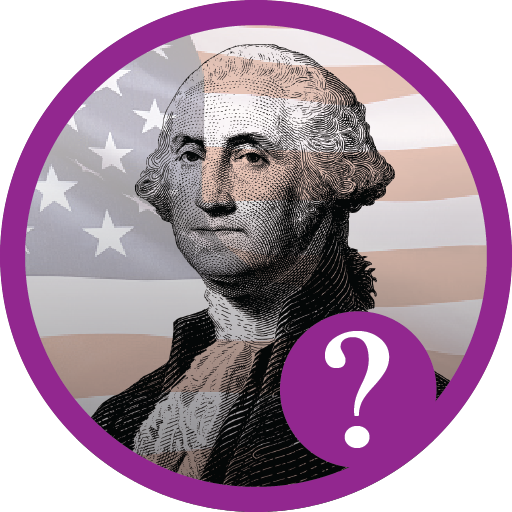
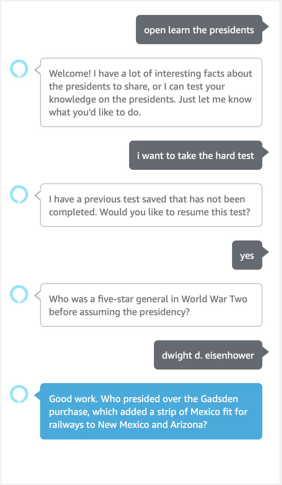
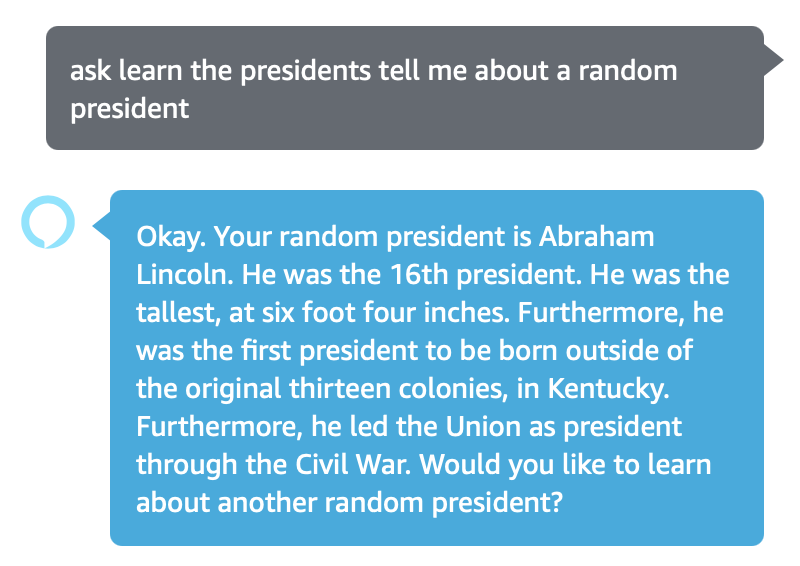
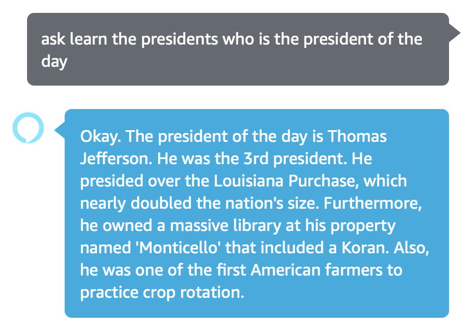

  

# Learn the Presidents

An Alexa skill to teach and reinforce knowledge about the U.S. presidents. Built with the [ASK SDK for Node.js](https://developer.amazon.com/en-US/docs/alexa/alexa-skills-kit-sdk-for-nodejs/overview.html). 

## Goal

Lessons from history are relevant for the modern world, and no other national figure has dominated U.S. politics like the office of president. By turning president knowledge into a free game, we hope to spark people's curiosity for U.S. History, and offer a fun audial experience people can use while doing laundry or while on the road.

## Features

* **Quiz.** There are two modes for the president quiz: Normal & Hard. Normal quizzes the user on the presidents in order, and hard gives you a random fact about the president and sees if you know who it is. The skill keeps track of your score so you can see your improvment over time!
  * *Alexa, ask Learn the Presidents to take the test.*
  * *Alexa, tell Learn the Presidents I want to take the hard test.*
  * *Alexa, ask Learn the Presidents, What's my high score?*

  

* **Facts.** You can learn facts about individual presidents, as well as info about a random one.
  * *Alexa, ask Learn the Presidents tell me about Thomas Jefferson.*
  * *Alexa, ask Learn the Presidents tell me about a random president.

  

* **Misc.** We've included features like a "President of the Day." (Beta)
  * *Alexa, ask Learn the Presidents, Who's the President of the Day?*

  

## Future Goals

* Send people a [reminder](https://developer.amazon.com/en-US/docs/alexa/smapi/alexa-reminders-overview.html) for the President of the Day.
* An "education mode" for people to learn about the presidents in order without taking a quiz.

## Contributions

If you'd like to contribute, please open an issue on GitHub. If we respond to it, you are welcome to attempt the change and open a pull request with the new code.